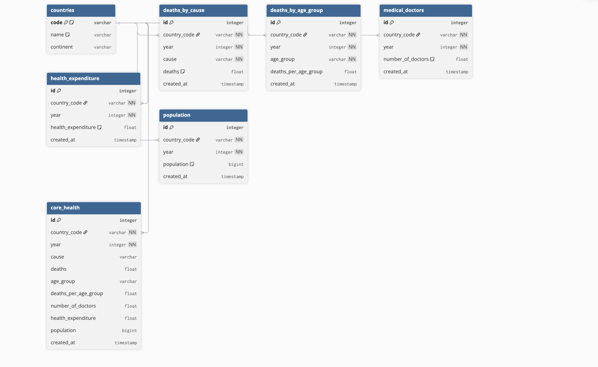

# Tackling the Health Crisis in Africa: A Data-Driven Analysis (2000-2019)

# Project Background

As a data analyst for a continental public health organization, my role is to analyze health trends across Africa to inform policy, guide resource allocation, and support strategic interventions. Our organization partners with national governments and NGOs to improve health outcomes. This project analyzes 20 years of health data (2000-2019) to identify the most pressing health challenges, pinpoint high-risk countries, and understand the demographic groups most at risk. The goal is to provide actionable insights to our directors and stakeholders to shape the next decade of public health strategy.

Insights and recommendations are provided on the following key areas:

-   **Category 1:** Overall Health Landscape in Africa
-   **Category 2:** High-Mortality Countries and Contributing Factors
-   **Category 3:** Leading Causes of Death by Country
-   **Category 4:** Age Group Vulnerability Analysis

The Python scripts used to wrangle and analyze the data for this project can be found here: [**Code**](https://github.com/GeamXD/A-Case-Study-on-Tackling-the-Health-Crises-in-Africa/blob/main/wrangle%20dataset.py).

An interactive Tableau dashboard used to report and explore these health trends can be found here: [**Live Dashboard**](https://public.tableau.com/views/ACaseStudyonTacklingHealthCrisisinAfrica/TacklingHealthCrisisDashboard?:language=en-GB&publish=yes&:sid=&:redirect=auth&:display_count=n&:origin=viz_share_link).

# Data Structure & Initial Checks

The analysis integrated five distinct datasets to create a comprehensive view of the public health landscape in Africa. The final merged dataset covers the years 2000 to 2019. A description of each data source is as follows:

-   **Causes of Deaths:** Contains records of the number of deaths attributed to various causes across different countries.
-   **Number of Deaths by Age Group:** Details mortality figures broken down by specific age demographics for each country.
-   **Medical Doctors Per 10,000 Population:** Provides data on the density of medical practitioners in African nations.
-   **Health Expenditure (% of GDP):** Shows national spending on health as a percentage of the Gross Domestic Product.
-   **World Population & Country Codes:** Contains UN population data and ISO codes used to standardize country names and join the datasets.

#### ETL Diagram

# Executive Summary

### Overview of Findings

Between 2000 and 2019, Africa recorded over **1.08 billion deaths**, with significant variations in mortality drivers across the continent. **Nigeria** emerges as the epicenter of the health crisis, registering the highest average deaths despite having a relatively high number of doctors, pointing to systemic issues beyond workforce numbers. The analysis reveals that while infectious diseases like **Malaria and HIV/AIDS** remain dominant killers in specific nations, non-communicable diseases like **Cardiovascular Diseases (CVD)** are the leading cause of death in others, highlighting the need for tailored, country-specific health strategies.

# Insights Deep Dive

### Category 1: Overall Health Landscape in Africa

-   **Staggering Mortality:** Across all African countries, a total of **1.08 billion deaths** were recorded from 2000 to 2019.
-   **Underfunded Health Systems:** The average health expenditure across the continent was only **5.37% of GDP**, indicating chronic underinvestment in the health sector.
-   **Physician Scarcity:** On average, there were only **3,500 doctors** per country (note: this is an aggregate number over the period, not per capita), serving an average estimated population of **19.18 million** people per country. This underscores a critical shortage of medical personnel.

### Category 2: High-Mortality Countries and Contributing Factors

-   **Top 5 Countries:** **Nigeria, Ethiopia, South Africa, the Democratic Republic of Congo, and Egypt** were identified as the countries with the highest average number of health-related deaths.
-   **The Nigerian Paradox:** Nigeria leads the continent in average deaths but has a comparatively low average health expenditure of **3.87%** (below the African average). Interestingly, it has a high total number of doctors (approx. 37k), suggesting that the high mortality rate may be driven by issues like resource allocation, infrastructure, and healthcare accessibility rather than just a lack of physicians.

### Category 3: Leading Causes of Death by Country

-   **Diverse Health Threats:** The primary causes of death vary significantly among the top high-mortality nations, proving a one-size-fits-all approach is ineffective.
    -   **Nigeria:** The leading cause of death is **Malaria**, followed by diarrhoeal diseases and neonatal disorders.
    -   **Ethiopia:** The primary driver of mortality is **neonatal disorders**, followed by diarrhoeal diseases and HIV/AIDS.
    -   **South Africa:** **HIV/AIDS** is the dominant cause of death, followed by neoplasms (cancers) and CVD.
    -   **Egypt & D.R. Congo:** **Cardiovascular Diseases (CVD)** are the chief cause of death in both countries, highlighting the growing burden of non-communicable diseases.

### Category 4: Age Group Vulnerability Analysis

-   **Youth Are Most at Risk:** In **Nigeria, Ethiopia, and the D.R. Congo**, the most vulnerable age group is **children under 5 years old**. This is consistent with leading causes like malaria, neonatal disorders, and diarrhoeal diseases.
-   **Working-Age Population Hit Hard in South Africa:** In South Africa, the highest fatality rate is among those aged **15-49**, which aligns with HIV/AIDS being the leading cause of death. This has severe economic and social implications.
-   **Older Population in Egypt:** In Egypt, the **50-69 year old** age group faces the highest mortality, which correlates with the prevalence of cardiovascular diseases.

# Recommendations:

Based on the insights above, we recommend that directors and public health stakeholders consider the following targeted actions:

-   High mortality from preventable and treatable diseases like malaria and diarrhoea in Nigeria and Ethiopia. **Recommendation: Increase investment in primary healthcare infrastructure, including clean water and sanitation systems. Launch targeted public health education campaigns.**

-   Nigeria's high death rate despite a large number of doctors suggests systemic inefficiencies. **Recommendation: Conduct a systemic review of Nigeria's health system to optimize resource allocation, improve medical supply chains, and enhance training for specialized care, particularly in pediatric and infectious disease management.**

-   The under-5 age group is extremely vulnerable in several key countries. **Recommendation: Strengthen antenatal and neonatal care programs by increasing fetal monitoring and diagnostic capabilities to tackle the high rate of neonatal disorders.**

-   HIV/AIDS remains the top killer of the working-age population in South Africa. **Recommendation: Intensify HIV/AIDS awareness campaigns focusing on safe sex practices and ensure widespread, consistent access to Anti-Retroviral Therapy (ART).**

-   Non-communicable diseases, especially CVD, are the leading cause of death in Egypt and Congo. **Recommendation: Implement national advocacy programs promoting healthy lifestyle habits (e.g., exercise, balanced diet) to combat the rise of CVD and other non-communicable diseases.**

# Assumptions and Caveats:

-   The analysis is strictly limited to the data available from **2000 to 2019**. Trends may have shifted since, especially due to the COVID-19 pandemic.
-   It is assumed that the country names and year fields across the five datasets were consistent enough for accurate joins. Minor discrepancies were cleaned and standardized using Python.
-   The accuracy of this analysis is contingent on the quality and reliability of the data reported by individual countries to international bodies like the UN and WHO.
-   The "number of doctors" metric represents an aggregate count and does not account for their distribution (urban vs. rural) or specialization, which are critical factors in healthcare quality.